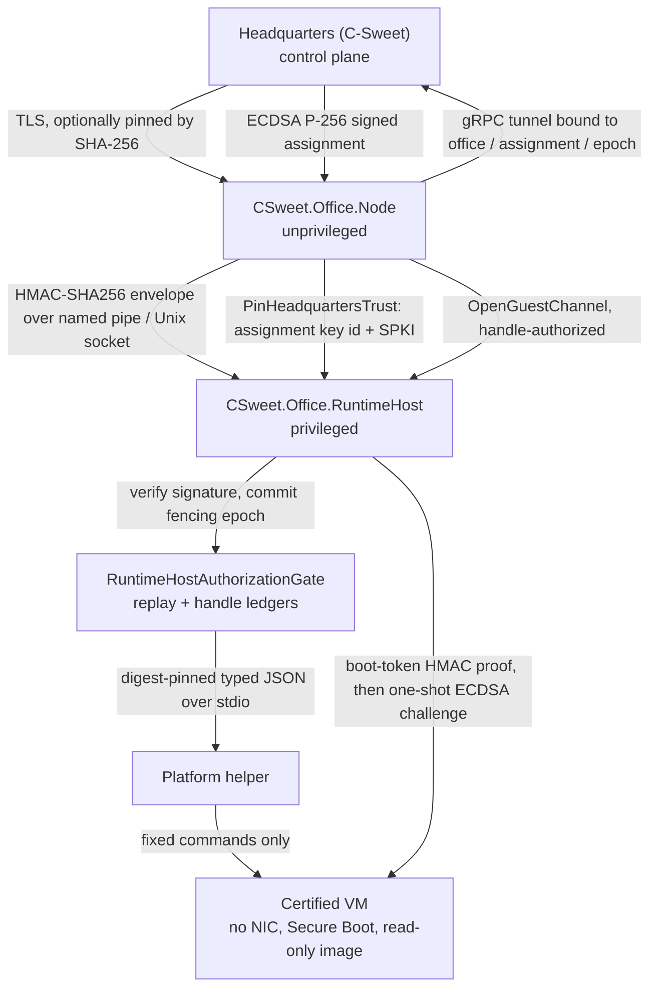

# Trust model

**Audience:** security reviewers, contributors touching anything privileged, operators deciding where to
install Office.

This page states who trusts whom, on what evidence, and what breaks if a trust decision is made wrongly.
Mechanisms are described in detail in [20-security/](../20-security/README.md); this page is the map.

## The chain

Reading the chain from left to right: Headquarters is the origin of authority, the Node is an untrusted
messenger, the RuntimeHost is the enforcement point, the helper is a narrow executor, and the guest is
untrusted code inside a hardware boundary.

## Principals and what they can do

| Principal | Can | Cannot |
|---|---|---|
| **Headquarters** | Issue assignments, issue and revoke Office certificates, authorize and store artifacts, run the host side of the guest broker, decide placement. | Reach into a host directly: Office opens no inbound management port. Recovery and repair are administrator-initiated from C-Sweet over outbound connections. |
| **Office installer** (administrator) | Pre-pin Headquarters assignment trust, create service accounts, set ACLs, enroll, choose the security posture. | Choose a posture that contradicts the signed request: development placement needs both opt-ins. |
| **`CSweet.Office.Node`** | Hold the Office identity, enroll, renew or recover its certificate, receive assignments, relay guest bytes, download artifacts within an assignment-scoped grant, write its own state. | Manage Hyper-V, modify RuntimeHost state, write to the immutable package, create a workload without a signed authorization. |
| **`CSweet.Office.RuntimeHost`** | Verify authorizations, commit epochs, drive helpers, create and destroy VMs, own the guest channel on Windows, read provider logs. | Accept unsigned or replayed work, accept a different assignment signing key, reach the network. |
| **Platform helper** | Probe the host, and create/start/inspect/stop/destroy/reap/read-logs for three typed workload kinds within its own roots. | Accept arbitrary operations or arguments, choose host paths, run arbitrary PowerShell, act on handles it never created, attach artifact media to builder workloads. |
| **Guest workloads** | Execute inside the VM under `setpriv` with no new privileges, talk to the local broker proxy, read the materialized artifact. | See the host filesystem, reach the network directly, read the boot token unless it is in the workload group, receive loader-affecting environment variables. |
| **Local interactive user** (holder of `ControlPlaneUserSid`) | Authenticate to the RuntimeHost over the local RPC transport. | Create a workload — a Headquarters signature is still required. This is an intentional defence-in-depth property, not an oversight. |
| **Host administrator** | Full control of the machine. | Is not defended against. A host administrator can read service state and tamper with the host. Dedicated, patched hosts are recommended for higher assurance. |

## The five trust decisions

### 1. Is this really my Headquarters?

The Node validates the control-plane TLS certificate. A SHA-256 pin may be supplied
(`ControlPlaneCertificateSha256` or `ControlPlaneTrustFilePath`); when a pin is present it **replaces PKI as
the trust anchor** — the leaf's fingerprint is compared in fixed time and name/validity are enforced, while
chain-building errors are deliberately ignored. Without a pin, any OS-trusted chain is accepted.

The Windows installer resolves the fingerprint, shows it to the operator, and requires an interactive
`TRUST` confirmation for a private CA. Non-interactive runs must pass the fingerprint explicitly.

See [20-security/01-identity-and-enrollment.md](../20-security/01-identity-and-enrollment.md).

### 2. Is this assignment signed by my Headquarters?

Two independent verifications, at two privilege levels:

- The **Node** validates the assignment before executing it: version, key id, identifiers, fencing epoch,
  time window (≤ 10 minute lifetime, ≤ 2 minute future skew), specification digest, and signature.
- The **RuntimeHost** re-validates inside `RuntimeHostAuthorizationGate.ValidateAndCommit`, in a strict
  order, and only then commits the fencing epoch. It additionally checks that the authorization's provider
  and workload id equal the request's, and that the workload id inside the *signed JSON* matches too.

The signature covers a canonical, purpose-separated byte layout
(`"CSweet.Office.WorkloadAuthorization"`) with big-endian fixed-width fields, so a field cannot be moved
between positions undetected.

See [20-security/04-workload-authorization.md](../20-security/04-workload-authorization.md).

### 3. Has this assignment already been accepted?

The RuntimeHost keeps `accepted-assignments.json`, a per-assignment high-water mark of fencing epochs. An
authorization whose epoch is lower than or equal to the stored value is rejected. The ledger is written
only *after* full validation, so unauthenticated traffic cannot burn an epoch.

The Node's own validation would have accepted a replay; the replay defence lives in the privileged
process, not the unprivileged one.

See [20-security/04-workload-authorization.md](../20-security/04-workload-authorization.md) and
[30-workloads/01-assignment-and-lease-semantics.md](../30-workloads/01-assignment-and-lease-semantics.md).

### 4. Is this really the Node calling me?

The Node authenticates to the RuntimeHost with an HMAC-SHA256 envelope over a length-delimited protobuf
frame, signed with a shared key (`runtime-host.key`, ≥ 32 bytes, file ACL-restricted). Each request carries
a 32-byte nonce with a replay cache and a ± 60 second clock-skew window. Signatures are verified **before**
the nonce is consumed. Both directions are authenticated: the server signs every response, and the client
validates the response signature, protocol version, and request-id echo.

Neither the transport nor the message shape can be used as an oracle: unauthenticated or wrong-protocol
frames are logged and the connection is closed with no response.

See [20-security/05-local-rpc-boundary.md](../20-security/05-local-rpc-boundary.md).

### 5. Is this workload authorized, certified, and actually isolated?

Three separate gates, all of which must pass:

- **Handle authorization.** Every non-create operation requires a handle recorded in
  `authorized-workload-handles.json`, matching the provider id, provider instance id, and workload kind,
  and unexpired — except termination operations, which deliberately bypass expiry so a stuck workload can
  always be torn down.
- **Provider certification.** The fail-closed selector requires an active, non-revoked, identity-matching
  certification, a live probe, and a matching guest image digest and broker protocol version. Zero
  survivors means `IsolationUnavailableException`, never a fallback.
- **Guest isolation.** The guest mounts artifact media read-only with `nosuid,nodev,noexec`, validates the
  bundle digest and tar contents, clears and rebuilds the workload environment from a 17-key allow-list,
  and runs the workload under an unprivileged user with `--no-new-privs`.

See [20-security/07-guest-isolation.md](../20-security/07-guest-isolation.md),
[20-security/08-provider-certification.md](../20-security/08-provider-certification.md), and
[20-security/09-helper-protocol.md](../20-security/09-helper-protocol.md).

## What the trust model does not claim

- The host operating system and the host administrator are trusted. Office does not defend against them.
- The PFX holding the Office identity has no password; protection is filesystem ACLs alone.
- The replay ledger for assignments is unbounded and is never pruned. Do not treat it as a cache.
- The nonce replay cache is process-local, so a restart clears it. The usable window is bounded by clock
  skew plus retention, not persistence.
- There is no in-place Headquarters key rotation path. A changed assignment signing key requires drain and
  re-enrollment.

These are recorded in full, with rationale, in
[20-security/12-known-limits-and-tradeoffs.md](../20-security/12-known-limits-and-tradeoffs.md).

## Sources

`src/CSweet.Office.Node/{OfficeWorker,ControlPlaneServerCertificateValidator,ControlPlaneCertificateProbe,OfficeStateStore}.cs`,
`src/CSweet.Office.Runtime.Protocol/RuntimeHostAuthentication.cs`,
`src/CSweet.Office.Runtime.LocalRpc/{RuntimeHostAuthorizationGate,RuntimeHostRpcServer,RuntimeHostRequestDispatcher}.cs`,
`src/CSweet.Office.Runtime.Core/{FailClosedIsolationProviderSelector,ExternalPlatformIsolationBackend,PlatformHelperContracts}.cs`,
`src/CSweet.Office.RuntimeGuest/{GuestWorkloadSupervisor,GuestArtifactMaterializer,GuestBrokerSession}.cs`,
`src/CSweet.Office.Runtime.HyperV.Helper/{HelperArguments,PowerShellHyperV}.cs`,
`scripts/windows/Install-CSweetOfficeRuntimeHost.ps1`, `README.md`.

Verified: 2026-09-15.
