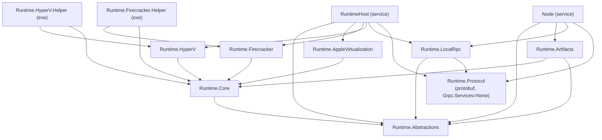

# Solution map

**Audience:** contributors. Read before changing project references or build configuration.

There are two solutions over the same source tree. One is for day-to-day development against a local
`CSweet.Office.Contracts` checkout; the other proves the published package boundary that CI and releases
use. Getting them confused is the most common build mistake in this repository.

## The two solutions

| | `CSweet.Office.slnx` | `CSweet.Office.Independent.slnx` |
|---|---|---|
| Purpose | Local development | CI and release boundary proof |
| `CSweet.Office.Contracts` | Sibling project under a `/dependencies/` solution folder | Absent — resolved as a NuGet package |
| `CSweet.Office.ToolchainGuest` | Listed | Not listed |
| Tests | Listed | Listed |
| Requires a sibling checkout | Yes | No |

Build commands:

```powershell
dotnet build CSweet.Office.slnx -c Release
dotnet build CSweet.Office.Independent.slnx -c Release -p:UseLocalOfficeContracts=false
```

CI and `scripts/release/Invoke-PlatformRelease.ps1` always pass `-p:UseLocalOfficeContracts=false` so the
package boundary is exercised rather than the local source.

> **ToolchainGuest asymmetry.** `CSweet.Office.ToolchainGuest` is absent from the independent solution, but
> `tests/CSweet.Office.Tests` references it unconditionally. Because the test project *is* in the
> independent solution, ToolchainGuest is still built transitively — which is why the CI `dotnet test
> --no-build` step succeeds. Do not "fix" the omission by adding it to the independent solution without
> understanding that the transitive reference is what currently keeps the build green.

## The contracts switch

`Directory.Build.props` defines `CSweetOfficeContractsRepositoryRoot` (default
`..\CSweet.Office.Contracts`) and sets `UseLocalOfficeContracts` automatically:

1. An explicit `-p:UseLocalOfficeContracts=…` always wins.
2. Otherwise it is `true` **only if** `$(CSweetOfficeContractsRepositoryRoot)\src\CSweet.Office.Contracts\CSweet.Office.Contracts.csproj`
   exists on disk.
3. Otherwise it is `false` and the pinned NuGet package is used.

`Directory.Build.targets` then applies, to every project except one literally named `CSweet.Office.Contracts`:

- a `ProjectReference` to the sibling project when the switch is `true`, otherwise a `PackageReference` to
  the pinned package; and
- a `Compile` link to `Office.GlobalUsings.cs`, which supplies `global using` directives for
  `CSweet.Office.Contracts.{ControlPlane, Guest, Security, Workloads}`.

> **Footgun.** If the sibling folder exists but contains a stale or uncommitted working tree, the switch
> silently defaults to `true` and you test contract code that is not in the released package. Always pass
> `-p:UseLocalOfficeContracts=false` when validating the release boundary.

See [50-development/03-contracts-dependency.md](../50-development/03-contracts-dependency.md) for the
cross-repository change workflow.

## Project dependency graph



The guest executables — `RuntimeGuest`, `BuilderGuest`, `ToolchainGuest`, `GuestProbe` — deliberately have
**no** project references. They compile against the `CSweet.Office.Contracts` package and the shared global
usings, so a guest binary never drags the runtime or provider libraries into the image. `RuntimeGuest` is
the sole exception: it references `Runtime.Protocol` because it needs the generated guest envelope types.

`Configurator` and `GuestProbe` likewise have no project references.

## Project inventory

| Project | Output | References | Purpose |
|---|---|---|---|
| `Runtime.Abstractions` | library | — | Provider-neutral contracts, models, and the provider catalog. |
| `Runtime.Core` | library | Abstractions | Shared backend plumbing: helper protocol, payload manifest, guest image registry, ISO writer, fail-closed selector, in-memory test doubles. |
| `Runtime.Protocol` | library | — (protobuf, `GrpcServices="None"`) | Private local RPC wire contracts and the HMAC request authenticator. |
| `Runtime.LocalRpc` | library | Abstractions, Protocol | Client and server for the Node↔RuntimeHost transport, the dispatcher, the provider client, and the authorization gate. |
| `Runtime.Artifacts` | library | Abstractions, Core | Filesystem artifact store and media (ISO) store. |
| `Runtime.HyperV` | library | Core | Hyper-V backend, `AF_HYPERV` socket transport, host probe, feature provisioner, Windows provisioner, progress store. |
| `Runtime.HyperV.Helper` | exe | Core, HyperV | Privileged, narrow Hyper-V lifecycle helper. |
| `Runtime.Firecracker` | library | Core | Firecracker backend and stdio guest-channel connector. |
| `Runtime.Firecracker.Helper` | exe | Core, Firecracker | Firecracker/jailer lifecycle helper and API client. |
| `Runtime.AppleVirtualization` | library | Core | Apple Virtualization backend and stdio guest-channel connector. |
| `Runtime.AppleVirtualization.Helper` | Swift executable | — | macOS helper. A Swift package, in neither solution. |
| `Node` | service exe | Abstractions, Artifacts, LocalRpc, Protocol | Unprivileged control client. |
| `RuntimeHost` | service exe | Abstractions, Apple, Firecracker, HyperV, LocalRpc, Protocol | Privileged virtualization service. |
| `Configurator` | exe | — | Windows enrollment handoff and maintenance service. |
| `RuntimeGuest` | exe | Protocol | In-guest broker and workload supervisor. |
| `BuilderGuest` | exe | — | In-guest plugin build runner. |
| `ToolchainGuest` | exe | — | In-guest toolchain adapter runner. |
| `GuestProbe` | exe | — | In-guest probe used only by the Hyper-V certification smoke test. |
| `WindowsSmokeTest` | exe | Abstractions, Core, Firecracker, HyperV, Protocol | Runs real guests and emits certification evidence only when isolation checks pass. |

## Shared build configuration

`Directory.Build.props` sets `TargetFramework` `net10.0`, `ImplicitUsings` and `Nullable` to `enable`,
`LangVersion` to `latest`, `EnforceCodeStyleInBuild` to `true`, and `VersionPrefix` to the current release
version. There is no `global.json`, so the .NET 10 SDK is whatever is on `PATH`.

`Directory.Packages.props` enables central package management with transitive pinning. Every package version
lives there; projects reference packages without a version. Adding a dependency means adding a
`PackageReference` without a version and a `PackageVersion` in `Directory.Packages.props`.

> **Gap worth knowing:** `EnforceCodeStyleInBuild` is `true` but the repository has no `.editorconfig`, so
> analyzer style rules run against the compiler defaults rather than a project-specific policy.

## Sources

`CSweet.Office.slnx`, `CSweet.Office.Independent.slnx`, `Directory.Build.props`, `Directory.Build.targets`,
`Directory.Packages.props`, `Office.GlobalUsings.cs`, `src/**/*.csproj`, `.github/workflows/ci.yml`,
`scripts/release/Invoke-PlatformRelease.ps1`, `tests/CSweet.Office.Tests/CSweet.Office.Tests.csproj`.

Verified: 2026-09-15.
