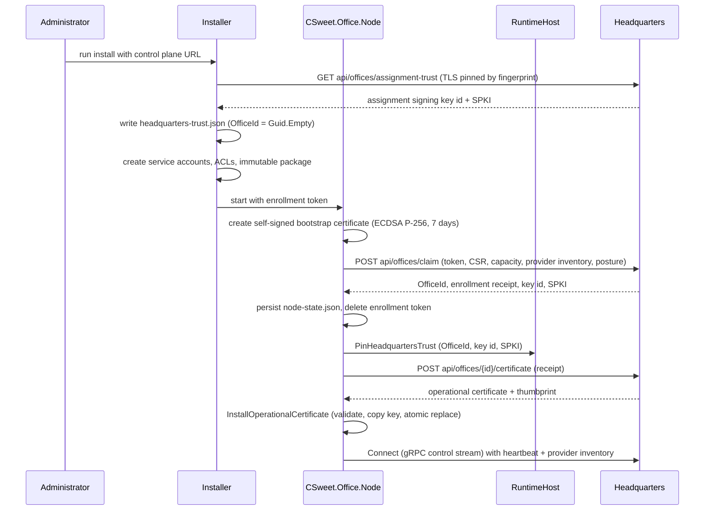
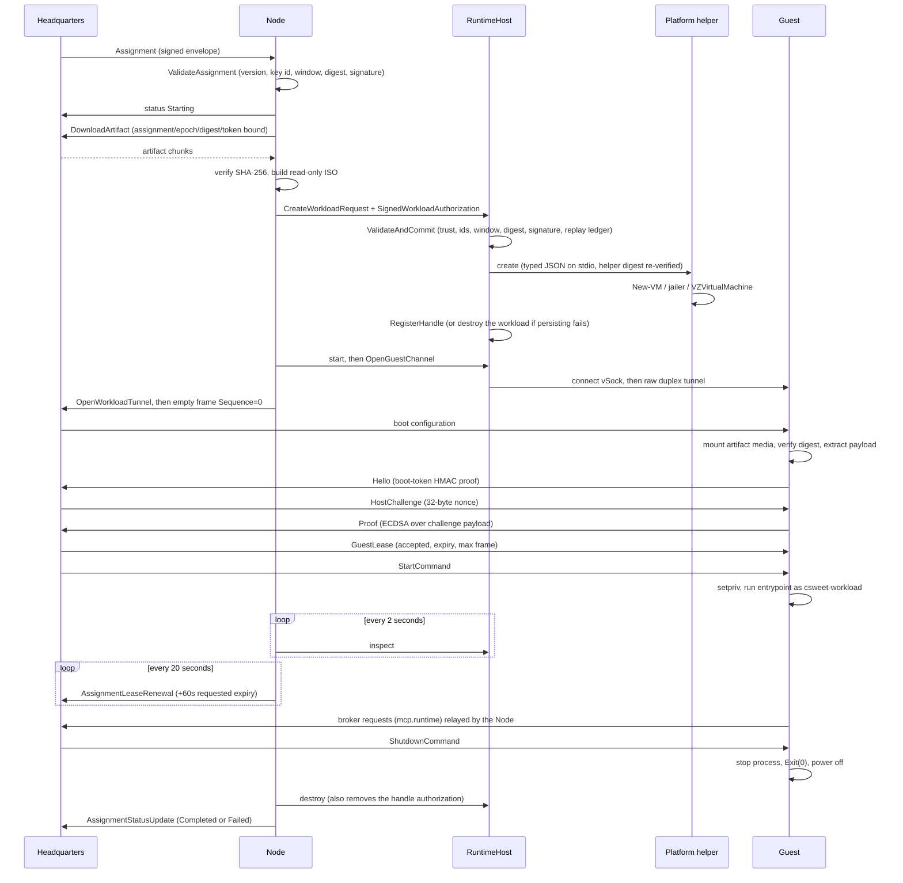
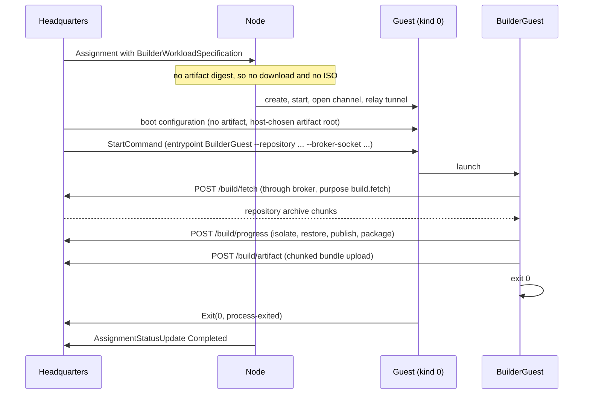

# Request and data flow

**Audience:** contributors and reviewers who need the timeline rather than the mechanism.

Three sequences cover almost everything: enrollment, a runtime workload, and a builder workload. Detailed
mechanisms live in [30-workloads/](../30-workloads/README.md).

## Enrollment

The installer pins the assignment key **before** the Office has an identity, writing `OfficeId = Guid.Empty`.
The RuntimeHost accepts exactly one upgrade from the empty office id to the real one; after that the pin is
write-once.

## Runtime workload

The Node relays bytes but does not construct the boot configuration, does not answer the handshake, and does
not decide whether a request is allowed. Those are Headquarters decisions.

## Builder workload

Builder workloads never attach artifact media — the RuntimeHost rejects `ArtifactImagePath` combined with a
builder spec.

## Control messages

Every inbound `HeadquartersControlMessage` must carry the matching `OfficeId` **and** `SessionEpoch`, or the
session is terminated.

| Message | Node response |
|---|---|
| `Hello` | Key id must match the pinned id and the SPKI must equal the enrolled bytes in fixed time. A mismatch kills the session. |
| `Assignment` | Validate, then either report `Failed` with `assignment-envelope-invalid` and keep the session, or dedupe into the active set, mark the local activity file, and execute. |
| `Fence` | Cancel the assignment's cancellation token. Teardown happens in the handler's `finally`. |
| `Drain` | Set the drain marker file. Nothing else — draining is reported, not enforced, by the Node. |

## Status reporting

The Node reports `Starting`, `Running`, then a terminal `Completed` or `Failed`. `Completed` requires
`State != Failed`, `ExitCode == 0`, and a termination reason of `None` or `Completed`; anything else is
`Failed` with `status.ErrorCode` or `workload-failed`.

Failure codes are deterministic and covered by tests. See
[80-reference/status-and-error-codes.md](../80-reference/status-and-error-codes.md).

## Sources

`src/CSweet.Office.Node/OfficeWorker.cs`, `src/CSweet.Office.Node/OfficeStateStore.cs`,
`src/CSweet.Office.Node/OfficeArtifactCache.cs`,
`src/CSweet.Office.Runtime.LocalRpc/{RuntimeHostRequestDispatcher,RuntimeHostAuthorizationGate}.cs`,
`src/CSweet.Office.Runtime.Core/ExternalPlatformIsolationBackend.cs`,
`src/CSweet.Office.RuntimeGuest/{Program.cs,GuestBrokerSession.cs}`,
`src/CSweet.Office.BuilderGuest/Program.cs`, `scripts/windows/Install-CSweetOfficeRuntimeHost.ps1`.

Verified: 2026-09-15.
