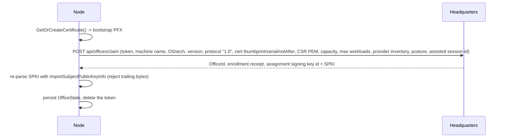

# Identity and enrollment

**Audience:** security reviewers and contributors touching `CSweet.Office.Node`.

Everything an Office knows about who it is, where that is stored, and how it is established.

## The Office identity record

`OfficeStateStore` persists a single record:

```csharp
public sealed record OfficeState(
    Guid OfficeId,
    string EnrollmentReceipt,
    long SessionEpoch,
    string CertificatePath,
    string AssignmentSigningKeyId,
    string AssignmentVerificationPublicKeyBase64);
```

`LoadAsync` returns `null` — treated as *not enrolled* — when the file is missing or corrupt, **or** when
`AssignmentSigningKeyId` or `AssignmentVerificationPublicKeyBase64` is blank. A partially written identity is
therefore not usable, which is the intended fail-closed behavior.

## On-disk layout

Beneath `OfficeOptions.ResolveStateDirectory()` (Windows install: `%ProgramData%\CSweet\Office\node`):

| File | Written by | Purpose |
|---|---|---|
| `node-state.json` | `SaveAsync` — temp file plus `File.Move(..., overwrite)` with `FileOptions.WriteThrough` | The `OfficeState` record. |
| `node-identity.pfx` | `GetOrCreateCertificate`, or `InstallOperationalCertificate` | ECDSA P-256 identity and private key. |
| `maintenance/drain-state` | `SetDraining` — contains `draining` or `ready` | The drain gate honored by the installer and the upgrade probe. |
| `maintenance/active-assignments/<assignmentId:N>.active` | `MarkAssignmentActive` / `MarkAssignmentInactive` | Per-assignment activity markers consulted before an upgrade. |
| `enrollment.secret` | Installer | The enrollment token. Deleted by `EnrollAsync` after use. |

## Private key protection

The PFX is written **without a password** and loaded with
`X509KeyStorageFlags.Exportable | X509KeyStorageFlags.PersistKeySet`. All protection comes from filesystem
ACLs: the Node service SID has modify rights on the state directory; `SYSTEM` and `Administrators` have full
control.

`Exportable` means the service identity can re-export the key. Anyone who can read the state directory can
exfiltrate the Office private key, which is the only credential that can drive the recovery endpoint.

> This is a recorded trade-off, not an oversight. See
> [12-known-limits-and-tradeoffs.md](12-known-limits-and-tradeoffs.md).

## The bootstrap certificate

Created locally so an unenrolled Office can make its first call:

- ECDSA P-256, `CN=CSweet Office <MachineName>`, self-signed.
- `NotBefore = now - 5 minutes`, `NotAfter = now + 7 days`.
- Extensions: `BasicConstraints(false, false, 0)`, `KeyUsage = DigitalSignature`, `SubjectKeyIdentifier`.
- `CreateCertificateSigningRequestPem` builds a CSR with the same extension set for the claim request.

Bootstrap detection is `Subject == Issuer`, and it drives the entire certificate path — see
[02-certificate-lifecycle.md](02-certificate-lifecycle.md).

## Enrollment



### Token handling

The enrollment token is accepted from exactly three places, in precedence order:

1. `OfficeOptions.EnrollmentToken` (in configuration).
2. `OfficeOptions.EnrollmentTokenFilePath` — the file is **deleted** after use (a deletion failure is a
   warning, not an error).
3. `Console.In.ReadLineAsync()` — refused outright when `Console.IsInputRedirected` is `false`.

After enrollment the token is cleared from the options object as well.

Enrollment tokens must not be placed in command-line arguments. The Linux installer enforces this by having
no `--enrollment-token` option at all — a property asserted by a test.

### What the Office reports

The claim request carries the machine name, OS and architecture, assembly version, protocol version, the
bootstrap certificate's thumbprint, serial and expiry, the CSR, allocatable CPU/memory/disk, maximum
concurrent workloads, the provider inventory, the security posture, and the assisted setup session id.

The response must contain an `OfficeId`, an enrollment receipt, an assignment signing key id, and an SPKI
public key. The SPKI is re-imported with `ECDsa.ImportSubjectPublicKeyInfo` and the import must consume every
byte — trailing data is rejected.

## Session epoch

On every process start the Node bumps its session epoch:

```
SessionEpoch = max(previous + 1, UnixTimeMilliseconds)
```

`long.MaxValue` is a hard error. The bumped state is cached in the process, so reconnects inside one process
reuse the same epoch — epoch reuse across reconnects is intentional, because Headquarters fences per epoch,
not per connection.

Every `HeadquartersControlMessage` must carry both the matching `OfficeId` and the matching `SessionEpoch`.
A mismatch terminates the session with `InvalidDataException` and the Node reconnects. This is what stops a
stale or misrouted control stream from acting on this Office.

Related invariants: `SEC-INV-06`.

## Reconnection behavior

The outer loop catches session termination, logs *"The office control session ended; reconnecting."*, and
waits a **fixed 5 seconds** — no exponential backoff, no jitter — before reloading state and reconnecting.
`OperationCanceledException` tied to the stopping token cancels silently.

## Sources

`src/CSweet.Office.Node/{OfficeStateStore.cs,OfficeWorker.cs,OfficeOptions.cs,Program.cs}`,
`tests/CSweet.Office.Tests/{OfficeTests.cs,OfficeCertificateRecoveryTests.cs}`,
`scripts/windows/Install-CSweetOfficeRuntimeHost.ps1`, `scripts/linux/install-office.sh`.

Verified: 2026-09-15.
