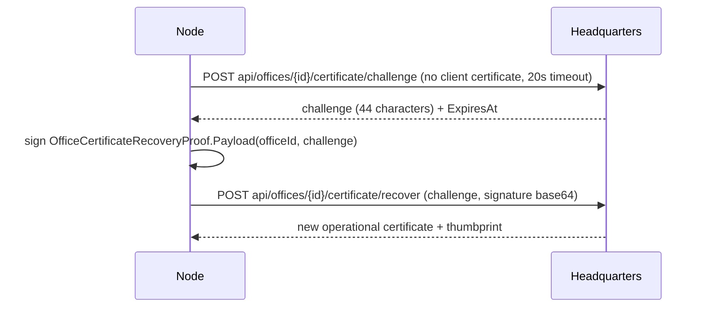

# Certificate lifecycle

**Audience:** security reviewers, contributors to `OfficeWorker` or `OfficeStateStore`, operators
diagnosing identity failures.

An Office holds a short-lived operational certificate. It renews while running, and if the certificate
expires during downtime it proves possession of its original enrolled private key instead of re-enrolling.

## The three-way split

`RefreshOperationalCertificateAsync` classifies the current certificate and picks exactly one path:

| Condition | Path |
|---|---|
| `Subject == Issuer` | **Bootstrap.** No operational certificate yet. |
| Not bootstrap and `NotAfter > now + renewalLead` | **None.** Return the current certificate without any network traffic. |
| Not bootstrap and `NotAfter <= now` | **Recovery.** The certificate expired while the Office was down. |
| Otherwise | **Renewal.** Normal rotation. |

`renewalLead = TimeSpan.FromTicks(min(6 hours, lifetime / 4))`.

## Renewal

```
POST api/offices/{officeId:D}/certificate
     OfficeCertificateRequest { BootstrapReceipt = bootstrap ? state.EnrollmentReceipt : "" }
```

- **Bootstrap requests** use the plain `HttpClient("control-plane")` — server certificate validation only, no
  client certificate, because there is nothing to present yet.
- **Non-bootstrap requests** use `CreateMutualTlsClient(current)`, which builds a handler from
  `ControlPlaneServerCertificateValidator` with the current certificate.
- A `401` on a **bootstrap** request keeps the current certificate. A `401` on a **non-bootstrap** request
  falls through to recovery.
- After installing, the Node re-asserts that the installed thumbprint equals the issued thumbprint, or
  throws.

### Renewal during a live session

`RenewDuringSessionAsync` runs a one-minute `PeriodicTimer` alongside the gRPC control stream, with a
20-second linked timeout per attempt. Renewal never interrupts active work.

The control channel is built with `CreateRotatingHttpHandler(() => certificates.Current)`, which sets:

- `ConnectTimeout = 20 seconds`
- `AllowTlsResume = false` — deliberately, so a resumed TLS session cannot outlive the certificate decision.
- `LocalCertificateSelectionCallback` choosing the current certificate per handshake.

## Retired certificate retention

`OfficeCertificateLease` keeps retired credentials alive past the handler's bounded handshake timeout:

- `Current` is read with `Volatile.Read`; there is a single writer.
- A retired certificate is pruned only when `GetElapsedTime(RetiredAt) >= 2 minutes`.
- A retired certificate is **never** selected for a new handshake.
- The initial certificate is never retired.
- `Dispose` disposes the current certificate (unless it is the initial one) and every retired certificate.

The two-minute retention is deliberately longer than the 20-second `ConnectTimeout`. Shorter values break
in-flight handshakes that are still using a certificate which has just been rotated.

Related invariant: `SEC-INV-05`.

## Recovery

Used when the certificate expired during downtime. The Office proves possession of the original enrolled
private key without presenting an expired certificate and without reusing the enrollment receipt.



Rules enforced in code:

- The challenge must be exactly **44 characters** and `ExpiresAt > UtcNow`.
- The signature uses `DSASignatureFormat.IeeeP1363FixedFieldConcatenation` over SHA-256 — note this differs
  from the assignment path, which uses the default DER format.
- The proof payload is domain-separated: `"csweet-office-certificate-recovery-v1\n{officeId:D}\n{challenge}"`.
- **Neither an expired client certificate nor the reusable enrollment receipt is sent to this endpoint.**
- Server authentication — including any configured pin — remains mandatory on both calls.

> The **one-use** property of the challenge is enforced **server-side**, by Headquarters. The Office checks
> only the shape and expiry. Do not weaken either side.

Related invariants: `SEC-INV-02`, `SEC-INV-03`, `SEC-INV-04`.

## Installing a certificate safely

`OfficeStateStore.InstallOperationalCertificate(current, certificateBase64, expectedThumbprint)` is the only
path that replaces the identity, and it validates before it writes:

1. `LoadCertificate` — reject if `NotAfter <= UtcNow`, if `NotBefore > UtcNow`, or if the thumbprint does not
   match `expectedThumbprint` (throws `CryptographicException`).
2. `CopyWithPrivateKey(current's ECDsa)` — throws `ArgumentException` on a key-binding mismatch, so a
   certificate issued for a *different* key cannot overwrite the durable identity.
3. Write `<pfx>.new`, `File.Move(..., overwrite: true)`, then reload.

Test `OfficeCertificateRecoveryTests.RejectedCertificateDoesNotOverwriteDurableIdentity` pins step 2.

This ordering is the reason a compromised or misconfigured server cannot silently replace an Office identity
with one whose private key it holds.

Related invariant: `SEC-INV-02`.

## Failure behavior

| Situation | Result |
|---|---|
| Renewal attempt fails | Warning logged, retried on the next one-minute tick. The session continues. |
| Renewal gets `401` on an operational certificate | Falls through to recovery. |
| Recovery challenge is the wrong shape or expired | Throws; the session does not proceed. |
| Installed thumbprint does not match issued thumbprint | Throws. |
| Certificate is expired and recovery fails | The Office cannot establish a control session. An administrator must act in C-Sweet. |

Revoked Offices and Offices that lost their private key require administrator intervention. Spent enrollment
receipts cannot recover identity.

## Sources

`src/CSweet.Office.Node/{OfficeWorker.cs,OfficeCertificateLease.cs,OfficeStateStore.cs}`,
`src/CSweet.Office.Runtime.LocalRpc/…` (rotating handler construction),
`tests/CSweet.Office.Tests/{OfficeCertificateRecoveryTests.cs,OfficeCertificateTlsTests.cs,OfficeTests.cs}`,
`releases/0.4.0.md`, `README.md`.

Verified: 2026-09-15.
