# Signed workload authorization

**Audience:** security reviewers; anyone touching `RuntimeHostAuthorizationGate`, `OfficeWorker`, or
`RuntimeHostProtocolMapper`.

No workload runs on an Office without a Headquarters signature that binds the office, the assignment, the
workload, the provider, the exact specification bytes, the validity window, and a fencing epoch. This page
describes that authorization and the two independent verifications it passes.

## The record

```csharp
public sealed record SignedWorkloadAuthorization
{
    // version, office / assignment / workload ids, fencing epoch, provider id,
    // specification JSON + sha256, signature key id, signature, issued / expires
}
```

Wire form: `runtime_host.proto` message `SignedWorkloadAuthorization`, field 13 of `CreateWorkloadRequest`.

## Bound fields

| Field | Protobuf | Bound to |
|---|---|---|
| `AuthorizationVersion` | `authorization_version` | `AssignmentEnvelope.CurrentAuthorizationVersion` (= 1) on both sides |
| `OfficeId` | `office_id` | the pinned trust `OfficeId` |
| `AssignmentId` | `assignment_id` | the replay-ledger key |
| `WorkloadId` | `workload_id` | the request's `workload_id`, the provider handle, and the id inside the signed JSON |
| `FencingEpoch` | `fencing_epoch` | the replay-ledger high-water mark; must be ≥ 1 |
| `ProviderId` | `provider_id` | `CreateWorkloadRequest.ProviderId`, exact ordinal comparison |
| `SpecificationJson` | field 7 | — |
| `SpecificationSha256` | field 8 | recomputed as `AssignmentEnvelope.Digest(json)` |
| `SignatureKeyId` | `signature_key_id` | the pinned `AssignmentSigningKeyId` |
| `Signature` | `signature` | ECDSA P-256 / SHA-256 over `AssignmentEnvelope.Payload(...)` |
| `IssuedAtUnixSeconds` / `ExpiresAtUnixSeconds` | 11 / 12 | skew and lifetime windows |

## The signed byte layout

The signature is not over JSON. It is over a canonical, purpose-separated byte sequence produced by
`CSweet.Isolation.Security.WorkloadAuthorizationEnvelope.Encode` via `AssignmentEnvelope.Payload`:

```
purpose = "CSweet.Office.WorkloadAuthorization"   UTF-8, int32 big-endian length-prefixed
version = 0x01
officeId | assignmentId | workloadId              16 bytes each, big-endian Guid
epoch                                             int64 big-endian
providerId | specificationSha256                  UTF-8, int32 big-endian length-prefixed
issuedAt | expiresAt                              int64 big-endian, Unix seconds
```

Properties that matter:

- **Domain separated** by the purpose string, so a signature from one protocol cannot be replayed into
  another.
- **Fixed width** for every identifier and timestamp, so bytes cannot be shifted between fields undetected.
- **Second granularity** timestamps: callers convert with `FromUnixTimeSeconds`, so signatures are stable
  across clock sub-second noise.
- `Digest(json) = "sha256:" + lowercase hex(SHA256(UTF8(json)))`; `IsDigest` requires exactly 71 lowercase
  hex characters.

> **Signature formats differ across the codebase.** This path uses the default .NET ECDSA format (DER). The
> certificate-recovery proof pins `IeeeP1363FixedFieldConcatenation`, and the guest handshake uses the
> default format. Porting a signature between these paths without changing the format is a silent failure.

> **Out of repo:** `AssignmentEnvelope`, `WorkloadAuthorizationEnvelope`, and the control-plane protos live in
> `CSweet.Office.Contracts`. Changing the layout is a cross-repository release, not a local edit.

## Verification stage 1 — the Node

`OfficeWorker.ValidateAssignment` is static and runs before any work is started. It rejects:

| Check | Failure |
|---|---|
| `AuthorizationVersion` mismatch | Envelope invalid |
| `SignatureKeyId` ≠ pinned key id | Envelope invalid |
| Unparsable or `Guid.Empty` assignment/workload id | Envelope invalid |
| `FencingEpoch < 1` | Envelope invalid |
| Blank provider id | Envelope invalid |
| `IssuedAt > now + 2 minutes` | Envelope invalid |
| `LeaseExpiresAt <= now` | Envelope invalid |
| `ExpiresAt - IssuedAt > 10 minutes` | Envelope invalid |
| `SpecificationSha256` ≠ recomputed digest | Envelope invalid |
| ECDSA verification failure | Envelope invalid |

A failure reports status `Failed` with error code `assignment-envelope-invalid` and **continues the
session** — an invalid assignment never kills the control stream and never executes. Identifiers are
re-parsed in `ToAuthorization` to build the abstraction record, so a document that parses as JSON but not as
identifiers cannot slip through.

## Verification stage 2 — the privileged boundary

`RuntimeHostAuthorizationGate.ValidateAndCommit` repeats the work at the privileged level and adds checks
that only make sense next to the request. The order is load-bearing:

```mermaid
graph LR
    A["trust pinned"] --> B["version"] --> C["identifiers"] --> D["key id"]
    D --> E["provider equality"] --> F["workload-id equality"] --> G["time window"]
    G --> H["digest recompute"] --> I["ECDSA verify"] --> J["deserialize specification"]
    J --> K["signed workload id match"] --> L["commit replay ledger"]
```



| Step | Detail |
|---|---|
| Time window | `MaximumClockSkewSeconds` (default 120) on `issuedAt`; `expiresAt > now`; lifetime ≤ `MaximumAuthorizationLifetimeSeconds` (default 600). Options are validated to 30–3600 seconds lifetime and 0–600 seconds skew. |
| Provider equality | The authorization's provider must equal the request's provider. |
| Workload-id equality | The authorization's workload id must equal the request's, compared case-insensitively **and** re-checked against the workload id inside the signed JSON after deserialization. |
| Specification deserialization | `RuntimeHostProtocolMapper.DeserializeSpecification` — JSON up to 16 MiB, `MaxDepth 32`. |
| Ledger commit | Last. See below. |

**Order matters.** Committing the ledger before signature verification would let unauthenticated traffic
burn fencing epochs — a denial-of-service primitive. Never reorder these steps.

Related invariant: `SEC-INV-08`.

## The replay ledger

`accepted-assignments.json` in `RuntimeHostAuthorizationOptions.ResolveStateDirectory()` (Windows installer:
`%ProgramData%\CSweet\Office\authorization`; Linux: `/var/lib/csweet/office/authorization`).

- Shape: `Dictionary<Guid assignmentId, long highestAcceptedEpoch>`, JSON, written atomically.
- Rule: `if (accepted.TryGetValue(assignmentId, out var previousEpoch) && previousEpoch >= authorization.FencingEpoch) throw`.
  A replay, or an *older* epoch, is rejected. A *newer* epoch supersedes and is persisted.
- All reads and writes happen under `lock (_sync)`.
- The ledger is advanced **only after** signature, digest, and time validation and specification
  deserialization all succeed.

The ledger is unbounded: one entry per assignment id, retained forever, with no pruning and no documented
retention policy. That is deliberate — pruning it would reopen the replay window. Do not "clean up" this
file to unstick a workload.

Related invariants: `SEC-INV-09`.

## Handle authorization

A second ledger, `authorized-workload-handles.json`, maps
`workloadId → AuthorizedHandle(AssignmentId, FencingEpoch, ProviderId, WorkloadId, ProviderInstanceId, WorkloadKind, ExpiresAt)`.

- `RegisterHandle` rejects a mismatched provider or workload, an empty `ProviderInstanceId`, and a workload
  whose `BrokerLease.ExpiresAt` is already in the past.
- The dispatcher calls `RegisterHandle` **after** `backend.CreateAsync` and, if persisting fails, **destroys
  the workload it just created** before rethrowing. A VM must never exist without an authorizing handle.
- `IsHandleAuthorized(handle, allowTermination)` matches provider id, provider instance id, and workload kind,
  and enforces expiry **unless** `allowTermination` is set.
- Termination operations deliberately bypass expiry so a failed or expired workload can always be torn down.
  `Destroy` is also the only operation that removes the handle authorization.

Related invariant: `SEC-INV-15`.

## There is no unsigned path

`RuntimeHostProviderClient.CreateAsync` — the `IAgentIsolationProvider` method, available to any caller that
holds the abstraction — is a hard failure:

```csharp
=> throw new IsolationUnavailableException(
       "RuntimeHost creation requires a signed Headquarters workload authorization.");
```

Only `CreateAuthorizedAsync` can create a workload, and `OfficeWorker.ExecuteAssignmentAsync` additionally
requires the provider to implement both `IRuntimeHostClient` and `IAgentGuestChannelProvider`, failing with
`IsolationUnavailableException` otherwise.

Related invariant: `SEC-INV-07`.

## Lease renewal and fencing

Two different clocks are in play. Do not conflate them:

| Mechanism | Cadence | Effect |
|---|---|---|
| `AssignmentLeaseRenewal` | every 20 seconds, `RequestedExpiry = now + 60 seconds` | Tells Headquarters the assignment is still running. It **does not** extend the signed authorization. |
| Signed authorization window | fixed at issuance | Hard-bounded at ≤ 10 minutes by both the Node and the gate. |
| `BrokerLease.ExpiresAt` | set by Headquarters in the boot configuration | Enforced by the guest session with `CancelAfter`. |
| `ResourceLimits.MaximumDurationSeconds` | set per workload | **Nothing in Office or the helpers enforces it.** |
| `Fence` control message | on demand | The Node cancels the matching assignment's cancellation token. The gate only *rejects* stale epochs — a fenced workload keeps running until the Node cancels it. |

That last row is worth stating plainly: **fencing is enforced by the Node's cancellation, not by the gate.**
The gate's job is to refuse to start or operate on work whose epoch is stale.

Related invariant: `SEC-INV-07` (no bypass) and the epoch rules above.

## Sources

`src/CSweet.Office.Runtime.Abstractions/IsolationPorts.cs`,
`src/CSweet.Office.Runtime.Protocol/runtime_host.proto`,
`src/CSweet.Office.Runtime.LocalRpc/{RuntimeHostAuthorizationGate.cs,RuntimeHostProtocolMapper.cs,RuntimeHostRequestDispatcher.cs,RuntimeHostProviderClient.cs}`,
`src/CSweet.Office.Node/OfficeWorker.cs`,
`tests/CSweet.Office.Tests/{RuntimeHostProtocolMapperTests.cs,RuntimeHostRpcIntegrationTests.cs,OfficeWorkerFailureTests.cs}`,
`scripts/windows/Install-CSweetOfficeRuntimeHost.ps1` (authorization options).

Verified: 2026-09-15.
