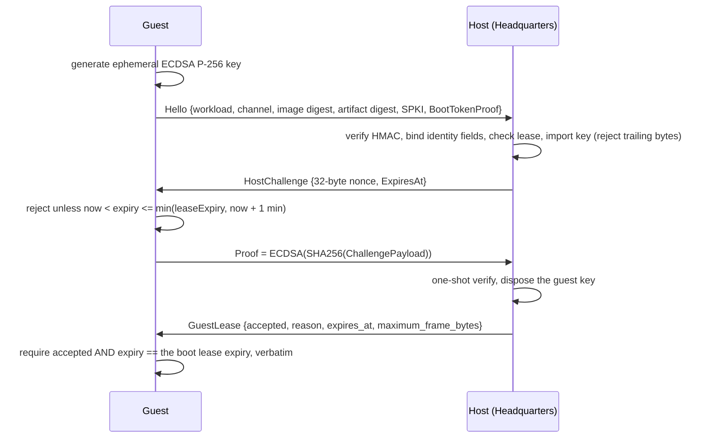

# Guest isolation

**Audience:** security reviewers; contributors to `RuntimeGuest`, `BuilderGuest`, `ToolchainGuest`, or the
guest image build.

The guest is untrusted code inside a hardware boundary. This page covers the boundary's inside: what the
guest will and will not accept, what it mounts, what environment the workload sees, and who the workload runs
as.

## Boot configuration validation

`GuestServiceOptions.Validate` rejects, before anything else happens:

| Rule | Detail |
|---|---|
| Identifiers | Workload and channel ids must be non-empty GUIDs. |
| Protocol | `protocol_version` must be exactly `"1.0"`. |
| Digests | `sha256:` format for the image, and for the artifact when one is present. |
| Boot token | At least 16 characters. |
| Lease | Must not already be expired. |
| Artifact root | Must be absolute. For workload kinds 1 and 2 it must be exactly `/run/csweet/artifact/payload`. |
| Identity | Kinds 1 and 2 require non-empty `InstallationId` and `TickId`, and `BusinessId` must parse as a **GUID** even though it is typed as a string. |
| Kind | Must be 0, 1, or 2. |
| Paths | The local broker socket and workload token paths must resolve **beneath `/run/csweet`**. |
| Frame size | `MaximumFrameBytes` between 4 KiB and 16 MiB. |

Kind 0 (Builder) deliberately skips the artifact and identity rules and may use any absolute artifact root —
it has no artifact and receives its build inputs through the environment instead.

## Artifact materialization

`GuestArtifactMaterializer` is the only component that reads host-supplied media.

### Device allow-list

`ResolveDevicePath` accepts **only**:

- `/dev/sr0` (the default — this is how Hyper-V presents the artifact), or
- `/dev/vdc`, when `CSWEET_GUEST_ARTIFACT_DEVICE` selects it.

Anything else throws `InvalidDataException("… not an approved immutable device.")`.

### Mount

`[LibraryImport("libc", "mount")]` mounts `iso9660` at `/run/csweet/artifact-media` with
`RDONLY | NOSUID | NODEV | NOEXEC` (literals `1 | 2 | 4 | 8`), and `umount2` runs in a `finally`.

### Bundle validation

`ExtractValidatedAsync` requires and enforces:

| Rule | Detail |
|---|---|
| Exactly one bundle | Exactly one file matching `artifact.csab*` on the media. |
| Digest | The whole stream is hashed and compared with the boot digest using `CryptographicOperations.FixedTimeEquals`. |
| Entry count | At most 10,000 tar entries. |
| Expanded size | At most 2 GiB. |
| Names | No duplicates, no case collisions, no absolute paths, no `.` or `..`, no control characters. |
| Entry types | **Links and special files are rejected.** |
| Layout | Only `artifact.json` and `payload/**`; both must exist. |
| Destination | Resolved beneath `/run/csweet` and double-checked by prefix. |

Modes are then rewritten: `0644` for files, `0755` only when the source had any execute bit, directories
`0750`, and world-write is always stripped (`SanitizeModeForWorkload`).

Related invariant: `SEC-INV-22`.

## Environment allow-list

`GuestWorkloadSupervisor.IsAllowedEnvironmentKey` accepts exactly **17** keys, all of them declarative build
inputs:

```
CSWEET_BUILD_ID, CSWEET_BUILD_EXPECTED_REVISION, CSWEET_BUILD_RECIPE_KEY, CSWEET_BUILD_TARGET_KEY,
CSWEET_BUILD_CONFIGURATION_JSON, CSWEET_BUILD_SOURCE_URL, CSWEET_BUILD_SOURCE_COMMIT,
CSWEET_BUILD_INPUT_ROOT, CSWEET_BUILD_OUTPUT_ROOT, CSWEET_BUILD_MAXIMUM_SOURCE_BYTES,
CSWEET_BUILD_MAXIMUM_OUTPUT_BYTES, CSWEET_CERTIFIED_IMAGE_DIGEST, CSWEET_ALLOWED_DEPENDENCY_REGISTRIES,
CSWEET_CERTIFICATION_FIXTURE_RESOURCE, CSWEET_WORKSPACE_MAXIMUM_ARCHIVE_BYTES,
CSWEET_WORKSPACE_MAXIMUM_EXPANDED_BYTES, CSWEET_WORKSPACE_MAXIMUM_FILE_COUNT
```

`PATH` and any loader-affecting variable are rejected. Limits: at most 32 entries, each value at most 4096
characters, no NUL bytes. `WorkspaceEnvironmentTests` pins this list.

### The fixed environment

`StartAsync` calls `start.Environment.Clear()` and then injects a fixed set — the caller cannot add to it:

| Variable | Value |
|---|---|
| `PATH` | `/usr/local/sbin:…:/bin` |
| `HOME` | `/tmp/csweet-agent` |
| `CSWEET_BROKER_ONLY` | `1` |
| `CSweet__Agent__McpEndpoint` | `http://localhost/mcp` |
| `CSweet__Agent__McpUnixSocketPath` | the local broker socket path |
| `CSweet__Agent__ManifestPath` | `csweet-plugin.json` — **forcibly overridden** |
| `CSweet__Agent__InstallationId`, `BusinessId`, `RuntimeInstanceId` (= workload id), `TickId`, `WorkloadTokenFile` | for kinds 1 and 2 |

The `ManifestPath` override is deliberate: it stops a stale packaged `appsettings.json` from pointing the SDK
at the retired `csweet-agent.json` convention.

## Process model

| Aspect | Behaviour |
|---|---|
| Linux launch | `/usr/bin/setpriv --reuid=csweet-workload --regid=csweet-workload --init-groups --no-new-privs -- <exe>` |
| Windows | Not launched this way; `GuestUnixFilePermissions` is a no-op on Windows. |
| Working directory | The artifact root. |
| Executable resolution | Full path, or relative to the artifact root. **One exception:** kind 2 may target the hard-coded certified runner `/usr/lib/csweet/toolchain/CSweet.Office.ToolchainGuest`. Everything else that escapes the artifact root throws *"The workload executable escapes the read-only artifact root"*. |
| Entrypoint | 1–64 items, each argument at most 4096 characters, no NULs. |
| Output budget | stdout and stderr are drained in 16 KiB reads; exceeding `MaximumLogBytes` kills the **process tree** and throws. |
| Diagnostic tail | The last 8 KiB is retained for the `runtime.logs` stream and the exit detail. |
| Stop | `Kill(entireProcessTree: false)`, wait the grace period (minimum 1 second), then escalate to `Kill(entireProcessTree: true)`. |
| Single start | A workload process is started once and is not restartable. |

Related invariant: `SEC-INV-21`.

## File ownership inside the guest

`GuestUnixFilePermissions` uses `File.SetUnixFileMode` plus:

- `/usr/bin/chgrp csweet-workload <file>` for `GrantWorkloadGroupAsync`, and
- `chgrp --recursive --no-dereference` for `GrantWorkloadTreeAsync`.

`WriteWorkloadToken` writes the boot token and grants `UserRead | GroupRead` (`0640`), so only the workload
group can read it. `DisposeAsync` deletes the token file.

The artifact materializer `chgrp -R`s the extracted tree to `csweet-workload`. This is what makes the
read-only artifact usable by a process that runs under `setpriv` as a different user.

## The authenticated guest channel

The guest proves it is the guest that received this boot configuration, and the host proves it is the host
that issued the lease.



- `BootTokenProof = HMACSHA256(UTF8(bootToken), payload)` where the payload is NUL-delimited:
  `csweet-guest-hello-v1`, protocol version, workload id, channel id, image digest, artifact digest, lease
  expiry, public key. The boot token must be at least 16 characters.
- The challenge payload is NUL-delimited:
  `csweet-guest-challenge-v1`, workload id, channel id, expiresAt, nonce.
- The verifier is one-shot (`_challenge` / `_completed` guards) and disposes the guest key after
  `VerifyProof`.
- The guest session cancels its whole session at lease expiry via
  `CancellationTokenSource.CancelAfter(leaseExpiry - now)`.

Related invariant: `SEC-INV-23`.

## The `prepare-runtime.sh` contract

Written into the Linux guest image by `build/linux-firecracker/provision-guest.sh` and run before
`CSweet.Office.RuntimeGuest`:

| Step | Failure mode |
|---|---|
| `/dev/vdb` must exist and be writable | exit 3 |
| `/dev/vdb` must not already be mounted | exit 4 |
| If `/dev/vdc` exists it **must** report read-only | exit 5 |
| `install -d -o root -g root -m 0700 /run/csweet` | — |
| `wipefs --all --force /dev/vdb`, `mkfs.ext4 -F -L CSWEET_SCRATCH` | — |
| `mount -t ext4 -o rw,nosuid,nodev /dev/vdb /run/csweet`, then `chmod 0711` | — |
| `/run/csweet/workload` owned `csweet-workload:csweet-workload`, mode `0700` | — |
| `exec /usr/lib/csweet/guest/CSweet.Office.RuntimeGuest` | — |

The guest image is built with `fstab` set to `/dev/vda / ext4 ro,nosuid,nodev` plus a `tmpfs` on `/tmp`; it
masks `systemd-networkd` and `systemd-resolved`; and it blanks `/etc/machine-id`.

The read-only check on `/dev/vdc` is the guest-side proof that the artifact device really is read-only. It
fails closed if the device reports writable.

## Sources

`src/CSweet.Office.RuntimeGuest/{GuestServiceOptions.cs,GuestArtifactMaterializer.cs,GuestWorkloadSupervisor.cs,GuestBrokerSession.cs,GuestBrokerTransport.cs,GuestUnixFilePermissions.cs}`,
`build/linux-firecracker/provision-guest.sh`, `build/windows-hyperv/provision-guest.sh`,
`tests/CSweet.Office.Tests/{GuestArtifactMaterializerTests.cs,WorkspaceEnvironmentTests.cs,GuestLocalBrokerProxyTests.cs}`,
`CSweet.Office.Contracts` `Guest/GuestHandshake.cs`.

Verified: 2026-09-15.
