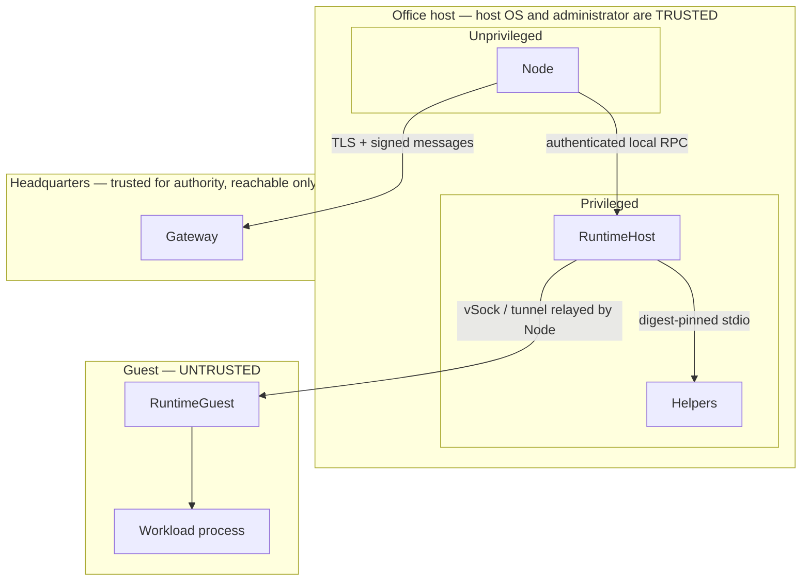

# Threat model

**Audience:** security reviewers and auditors. This page states what Office defends against, what it does
not, and which control answers which threat.

## Assets

| Asset | Where it lives | Why it matters |
|---|---|---|
| Office identity private key | `node-identity.pfx` | The only credential that can drive the certificate recovery endpoint. Whoever holds it can impersonate the Office. |
| Headquarters assignment signing key (public half) | pinned trust file | The anchor of every authorization decision. Replacing it would let an attacker authorize arbitrary work. |
| Local RPC shared key | `runtime-host.key` | Authenticates the Node to the RuntimeHost. Not sufficient on its own to create work. |
| Certified guest images and helper binaries | immutable payload | Their integrity is what makes "certified" meaningful. |
| Artifacts | cache and media, guest filesystem | Untrusted code and, potentially, sensitive data. |
| The isolation boundary | the hypervisor | The primary control protecting customer workloads from each other and from the host's other tenants. |
| Host integrity | the machine and its OS | Trusted by construction. |
| Fleet integrity | Headquarters | An Office must not become unauthorized compute. |

## Adversaries and controls

| Adversary | Goal | Controls that answer it |
|---|---|---|
| **Malicious workload code** inside a guest | Escape the VM, read host or other tenants' data, persist | Hardware virtualization with a dedicated kernel, no network device, read-only base disk, ephemeral scratch, `setpriv` with `--no-new-privs`, environment allow-list, read-only artifact mount with `nosuid,nodev,noexec`, bounded log budget with process-tree kill |
| **Malicious or corrupted artifact** | Execute unintended code, exhaust resources | Whole-stream SHA-256 verification before extraction, tar limits (10,000 entries, 2 GiB expanded, no links or special files, no traversal or case collisions), mode rewriting, `chgrp` to the workload group only |
| **Local unprivileged user** on the Office host | Create unauthorized workloads, hijack handles, read Office state | Named-pipe DACL and `0660` Unix socket, HMAC-authenticated RPC with nonce replay protection, authorization gate requiring an HQ signature, protected state ACLs. Note the interactive control-plane user *can* authenticate RPC calls but still cannot create workload — see [12-known-limits-and-tradeoffs.md](12-known-limits-and-tradeoffs.md) |
| **Rogue or substituted control plane** | Redirect an existing Office, issue its own work | Installer pre-pin of assignment trust over a verified TLS connection, write-once RuntimeHost pin, `Hello` re-confirmation with a fixed-time key comparison, pin enforcement in `ValidateAndCommit` |
| **Network attacker** on the path to Headquarters | Intercept, redirect, replay | HTTPS only (startup refuses non-HTTPS), optional SHA-256 pin that replaces PKI as the anchor, `AllowTlsResume = false`, mTLS with the rotating operational certificate |
| **Replay of a captured assignment** | Re-run accepted work, or pin an epoch | Fencing-epoch replay ledger in the privileged process, plus a second replay cache for RPC nonces |
| **Local process tampering** with helpers or payload | Run arbitrary code as root | Helper digest re-verified on every invocation, payload verified against the runtime manifest before install, explicit non-inherited `RX` ACEs on the package, `Assert-FileReadExecuteAce` fails installation |
| **Compromised Headquarters key** | Direct unrelated Offices | Pin prevents a *different* key from being accepted; revocation and re-enrollment are the recovery paths |
| **Another Hyper-V administrator on a shared host** | Control Office VMs | Out of scope as a control. Mitigated operationally by using a dedicated Office machine — see README guidance |
| **Supply chain in a builder workload** | Inject a malicious dependency | All NuGet traffic is brokered and loopback-proxied, `signatureValidationMode=require`, pinned repository-signer fingerprints, `allRepositorySigned` must be true |
| **A malicious Office against Headquarters** | Nothing — Headquarters already treats Office as untrusted | Not a threat this repository answers; Office holds no HQ-side authority |

## Trust boundaries

The two boundaries that carry the most weight:

1. **Node → RuntimeHost.** Crosses from unprivileged to privileged, so it is fully authenticated in both
   directions and the receiving side re-validates the Headquarters signature independently.
2. **Host → Guest.** Crosses into untrusted code, so the guest's inputs are validated (boot configuration,
   handshake) and the workload's environment is rebuilt rather than inherited.

## Explicit non-goals

Office does **not** claim to defend against:

- **A compromised host operating system or a malicious host administrator.** They are trusted. They can read
  guest disk images, tamper with services, and read the Office private key.
- **Side channels** between the guest and the host or other guests.
- **Confidential computing attestation.** Hyper-V declares no measured- or verified-boot capability;
  Firecracker and Apple Virtualization declare theirs, but neither provides remote attestation to Headquarters
  through this repository.
- **Denial of service by a resource-exhausting workload beyond declared limits.**
  `ResourceLimits.MaximumDurationSeconds` is not enforced by Office or the helpers.
- **Physical access** to the host.
- **A malicious Headquarters.** Office enforces the *pin*, not the *policy*. A compromised Headquarters that
  holds the legitimate signing key can direct this Office.
- **Multi-tenant safety on a shared Hyper-V host** where unrelated higher-trust VMs exist.

## Residual risks worth naming

| Risk | Mitigation available today |
|---|---|
| No pin configured → any OS-trusted chain is accepted | Configure `ControlPlaneCertificateSha256` or the trust file. The Windows installer requires an explicit fingerprint in non-interactive mode. |
| PFX is passwordless and exportable | Filesystem ACLs only. Restrict who can read the Node state directory. |
| Assignment replay ledger grows without bound | None. It is intentional; pruning would reopen the replay window. |
| Nonce replay cache is process-local | Accept; the exposure window is bounded by clock skew plus retention. |
| Apple reaper handles only kind 1 | Manually destroy orphaned builder and toolchain VMs. |
| Windows helper logs are empty | Rely on guest `runtime.logs` and the Event Log. |

These are expanded in [12-known-limits-and-tradeoffs.md](12-known-limits-and-tradeoffs.md).

## Sources

The whole [20-security](README.md) section; `README.md`, `AGENTS.md`,
`src/CSweet.Office.Runtime.Core/{FailClosedIsolationProviderSelector.cs,ExternalPlatformIsolationBackend.cs}`,
`src/CSweet.Office.Runtime.LocalRpc/RuntimeHostAuthorizationGate.cs`,
`src/CSweet.Office.RuntimeGuest/*`, `src/CSweet.Office.BuilderGuest/Program.cs`,
`scripts/windows/Install-CSweetOfficeRuntimeHost.ps1`.

Verified: 2026-09-15.
