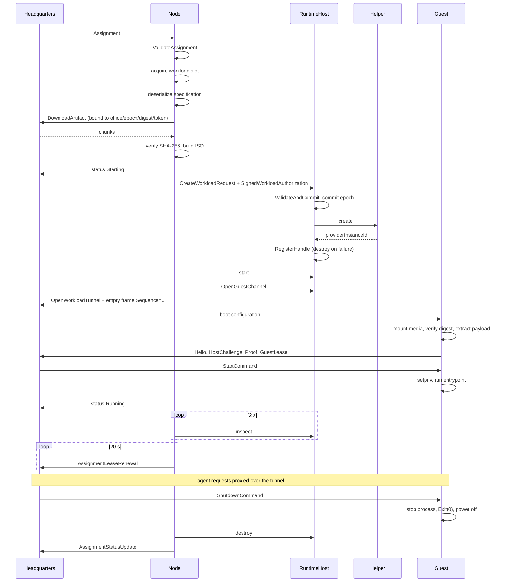

# Runtime workload lifecycle

**Audience:** contributors, reviewers, and operators diagnosing a failed assignment.

Workload kind **1**. The workload runs an agent from a materialized artifact, with artifact media attached.

## Sequence



## Step detail

### 1. Validation

`OfficeWorker.ValidateAssignment` (see
[20-security/04-workload-authorization.md](../20-security/04-workload-authorization.md)) rejects the envelope
and reports `assignment-envelope-invalid` without terminating the session.

### 2. Admission

`_workloadSlots.WaitAsync(...)` against `MaximumConcurrentWorkloads`. This is the only backpressure.

### 3. Specification

`DeserializeSpecification` switches on a `"kind"` / `"Kind"` discriminator with `PropertyNameCaseInsensitive`
and `MaxDepth 32`. Only `RuntimeWorkloadSpecification` and `ToolchainBuildWorkloadSpecification` carry an
artifact digest.

### 4. Artifact acquisition — before the VM exists

If the specification has an artifact digest, the assignment must carry an `ArtifactReadToken` of 32–256
characters, and the Node calls `OfficeArtifactCache.EnsureAsync(gatewayClient, state, assignment, digest, token)`.

**The download and the ISO build complete before any VM is created.** The provider re-verifies the ISO at
create time, and Hyper-V makes and re-verifies a private copy inside the instance directory.

Details in [05-artifacts-and-media.md](05-artifacts-and-media.md).

### 5. Create

`RuntimeHostProviderClient.CreateAuthorizedAsync(specification, ToAuthorization(state, assignment))` sends the
request with the full signed envelope. The gate validates and commits, then the backend invokes the helper.

Status `Starting` is reported **after** the artifact work, not before.

### 6. Start and open the channel

`provider.StartAsync(handle)`, then `IAgentGuestChannelProvider.OpenGuestChannelAsync(handle)`, then a
`RelayGuestChannelAsync` task is started and status `Running` is reported.

### 7. The relay's mandatory first frame

`RelayGuestChannelAsync` opens `OpenWorkloadTunnel` and **immediately writes an empty
`WorkloadTunnelFrame { Sequence = 0, Content = empty, Completed = false }`** before starting either relay
direction.

**Why:** Headquarters cannot start its broker session until the first bound frame arrives, and the Linux guest
waits for Headquarters' boot configuration. If the Node waited for guest bytes before sending anything, the
three parties would deadlock. Omitting this frame hangs every workload.

Upload then uses `Sequence = 1..n` in 64 KiB chunks, ending with `Completed = true` and empty content.
Download asserts `frame.Sequence == expectedSequence++` starting at **0** and a matching `FencingEpoch`, and
breaks on `Completed`. Whichever direction finishes first is awaited; the other is then cancelled.

### 8. Guest-side boot

The guest receives boot configuration, validates it
([20-security/07-guest-isolation.md](../20-security/07-guest-isolation.md)), materializes the artifact by
mounting the media and verifying the bundle digest, then performs the authenticated handshake and starts the
workload under `setpriv`.

### 9. Run

The agent SDK talks HTTP/1.1 to the local broker socket. The guest converts each request into a `ProxyRequest`
with a purpose, and the Node relays it as tunnel frames. Headquarters authorizes by purpose and answers with a
`ProxyResponse`.

Meanwhile the Node inspects every 2 seconds and renews the lease every 20 seconds.

### 10. Completion

Three ways a runtime workload ends:

| Trigger | Result |
|---|---|
| Headquarters sends `ShutdownCommand` | Guest stops the process with a grace period, emits `Exit(0, reason)`, powers off. |
| The process exits on its own | Guest emits `Exit(code, "process-exited", tail)`. |
| The log budget is exceeded | Guest emits `Exit(137, "resource-limit-exceeded")`. |

### 11. Status classification

```
Completed  iff  State != Failed && ExitCode == 0 && TerminationReason in { None, Completed }
Failed     otherwise, with status.ErrorCode ?? "workload-failed"
```

Logs are read on both paths: `ReadLogsAsync` with a 64 KiB cap, decoded as UTF-8, placed in `LogExcerpt`.

### 12. Teardown

Always `DestroyAsync(handle, CancellationToken.None)`, then release the slot, remove the local activity
marker, and dispose the cancellation source.

## Failure classification

`DescribeExecutionFailure` maps exceptions to stable codes. Tests assert these exact behaviors.

| Exception | Failure code | Detail |
|---|---|---|
| `IsolationUnavailableException` | `isolation-provider-unavailable` | Message passed through verbatim, e.g. *"Hyper-V is not enabled."* |
| `RpcException` `FailedPrecondition` | `headquarters-broker-rejected` | Headquarters detail, control characters stripped, 1500-character cap |
| `RpcException` `PermissionDenied` / `Unauthenticated` | `headquarters-authorization-rejected` | No detail |
| `RpcException` `Unavailable` / `DeadlineExceeded` | `headquarters-unavailable` | No detail |
| Other `RpcException` | `headquarters-rpc-error` | Status code only |
| Anything else | `office-error` | A generic message naming the exception type and telling the reader to use the assignment identifier in the Node service log. The original message is **deliberately not leaked** — a test asserts that a string like `password=do-not-leak` never appears. |

## Sources

`src/CSweet.Office.Node/{OfficeWorker.cs,OfficeArtifactCache.cs}`,
`src/CSweet.Office.Runtime.LocalRpc/{RuntimeHostProviderClient.cs,RuntimeHostRequestDispatcher.cs}`,
`src/CSweet.Office.RuntimeGuest/{Program.cs,GuestBrokerSession.cs,GuestWorkloadSupervisor.cs,GuestArtifactMaterializer.cs}`,
`tests/CSweet.Office.Tests/{OfficeWorkerFailureTests.cs,RuntimeHostRpcIntegrationTests.cs}`.

Verified: 2026-09-15.
