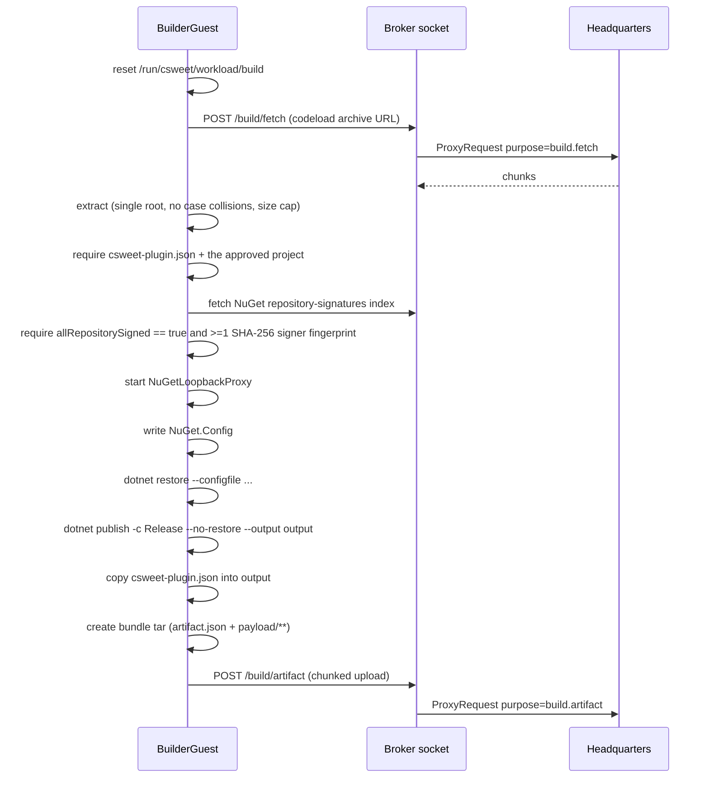

# Builder and toolchain lifecycles

**Audience:** contributors and reviewers working on build workloads.

Two of the three workload kinds build something: kind **0** (Builder) compiles a plugin from a repository, and
kind **2** (ToolchainBuild) runs a certified adapter from a materialized package. Neither attaches artifact
media.

## How the kinds relate

| Kind | In-image runner | Artifact media | Identity environment | Source of inputs |
|---|---|---|---|---|
| `0` Builder | `CSweet.Office.BuilderGuest` | None | Not required | `StartCommand.Environment` plus command-line arguments |
| `1` Runtime | the materialized `payload/<entrypoint>` | Required | Required (`InstallationId`, `BusinessId`, `TickId`) | Materialized artifact |
| `2` ToolchainBuild | `/usr/lib/csweet/toolchain/CSweet.Office.ToolchainGuest` | Required | Required | Materialized adapter package plus env vars |

Kind 0 is the only kind that skips the artifact and identity rules in `GuestServiceOptions.Validate`, and the
only kind that may use an arbitrary absolute artifact root.

> **Out of repo:** the boot configuration and `StartCommand` for every kind are authored by Headquarters.
> Nothing in this repository decides the entrypoint, the argument list, or the artifact root for a production
> build.

## Builder workload (kind 0)

### Invocation

`BuilderProgram` accepts strict argument pairs:

| Argument | Constraint |
|---|---|
| `--repository` | HTTPS `github.com/owner/repo` only |
| `--commit` | 40 hexadecimal characters |
| `--project` | `*.csproj` |
| `--maximum-repository-bytes` | 1 B – 2 GiB |
| `--maximum-artifact-bytes` | 1 B – 10 GiB |
| `--broker-socket` | the local broker socket path |
| `--target-framework` (optional) | one of `net8.0`, `net9.0`, `net10.0` |

### Flow



Steps in words:

1. Reset `/run/csweet/workload/build`.
2. Download the **exact commit** archive from `https://codeload.github.com/<owner>/<repo>/zip/<commit>` —
   through the broker, never directly.
3. Extract: single root directory, no case collisions, subject to `--maximum-repository-bytes`.
4. Require `csweet-plugin.json` and the approved project file.
5. `NuGetTrustedRepository.LoadAsync` fetches
   `https://api.nuget.org/v3-index/repository-signatures/5.0.0/index.json` through the broker and requires
   `allRepositorySigned == true` and at least one SHA-256 signer fingerprint
   (`2.16.840.1.101.3.4.2.1`).
6. Start `NuGetLoopbackProxy` and write a `NuGet.Config` with a single source (`csweet-broker`),
   `signatureValidationMode=require`, and a `trustedSigners`/repository entry carrying the pinned fingerprints.
7. `dotnet restore --configfile …` then `dotnet publish --configuration Release --no-restore --output output`.
8. Copy `csweet-plugin.json` into the publish output.
9. `CreateBundleAsync` builds a tar containing `artifact.json`
   (`{ formatVersion: "1.0", operatingSystem: "linux", architecture: "x64"|"arm64", entrypoint: [projectName] }`)
   and `payload/**`, with uid/gid 0, symlinks rejected, at most 10,000 files, and the declared size cap
   enforced.
10. Upload through `/build/artifact`.

### The NuGet loopback proxy

This is the mechanism that keeps the build network-free from the workload's point of view.

- A `TcpListener` on `127.0.0.1:0`, wrapped in `SslStream` with a self-signed certificate exported as
  `loopback-ca.pem` and handed to the toolchain through `SSL_CERT_FILE`.
- The service index is `https://localhost:<port>/v3/index.json`; request paths encode the upstream URL.
- Downloads go through the broker with a 512 MiB per-entry cap and a per-key `SemaphoreSlim` cache.

**All** NuGet traffic is brokered. Nothing reaches the network except through `/build/fetch`.

### Progress reporting

`BuilderBrokerClient` posts `{step, status, detail}` to `/build/progress`. Observed steps are `isolate`,
`restore`, `publish`, and `package`, with statuses `started` and `succeeded`.

### Broker client surface

| Endpoint | Purpose | Headers |
|---|---|---|
| `POST /build/progress` | Step reporting | — |
| `POST /build/fetch` | Download chunks | `{url, offset, maximumBytes}` plus `X-CSweet-Content-Type`, `X-CSweet-Complete` |
| `POST /build/artifact` | Upload chunks | `X-CSweet-Sequence`, `X-CSweet-Completed`, `X-CSweet-Digest` |

### Builder-specific restrictions

- **Adapter media is refused.** Artifact media with a builder spec produces `invalid-artifact-media`.
- **Reaping skips builders.** Hyper-V and Firecracker reap only Runtime and ToolchainBuild instances; Apple
  reaps only Runtime. A crash during a builder run can therefore leave an orphaned VM.

## Toolchain workload (kind 2)

### Invocation

`ToolchainGuestProgram` requires exactly one argument, `--adapter-entrypoint <absolute path>`, pointing at the
certified adapter inside the materialized artifact package.

### Environment inputs

| Variable | Use |
|---|---|
| `CSWEET_BUILD_INPUT_ROOT` | Where the source tree is placed |
| `CSWEET_BUILD_OUTPUT_ROOT` | Where the adapter writes its output |
| `CSWEET_BUILD_MAXIMUM_SOURCE_BYTES` | 1 B – 2 GiB |
| `CSWEET_BUILD_MAXIMUM_OUTPUT_BYTES` | 1 B – 10 GiB |
| `CSWEET_BUILD_SOURCE_URL` | Repository URL |
| `CSWEET_BUILD_SOURCE_COMMIT` | Commit to build |
| `CSweet__Agent__McpUnixSocketPath` | Broker socket (default `/run/csweet/broker.sock`) |
| `CSWEET_CERTIFICATION_FIXTURE_RESOURCE` (optional) | A fixture copied from inside the adapter package, used for certification runs |

### Source acquisition and the anti-substitution check

`SourceArchiveUri` honours a trusted archive URI of the form

```
csweet-source://build/<buildGuid:N>/<commit>
```

**only when `<buildGuid:N>` equals `CSWEET_BUILD_ID` exactly**. Otherwise it constructs the
`codeload.github.com` URL itself. This is a fail-closed check against source substitution and SSRF: a
Headquarters-supplied URI cannot redirect the build to an arbitrary location unless it names this exact build.

`X-CSweet-Archive-Layout` (`flat` or `provider-rooted`) must stay stable across chunks.

### Completion and output

1. The adapter must create `<output>/.csweet-adapter-complete`.
2. `UploadWhenReadyAsync` polls for that marker **and fails if the adapter process exits first** — a crashed
   adapter cannot produce a partial success.
3. The output tar is **deterministic**: `PaxTarEntry` with a fixed `ModificationTime` of
   `2000-01-01T00:00:00Z`, uid/gid 0, and empty user and group names. It contains `artifact.json`
   (entrypoint `run-output`), a generated `payload/run-output` shell script, and `payload/output/**` with
   `.csweet-*` files excluded.
4. Upload, then write `.csweet-output-uploaded`.

Determinism matters because the artifact digest becomes part of the provenance record on the Headquarters
side.

## What Office does with a build result

Nothing. `build.artifact` and `build.progress` arrive as `ProxyRequest`s and are relayed verbatim.

`IBuilderArtifactResultStore`, `IBuilderArtifactResultPublisher`, and `InMemoryBuilderArtifactResultStore`
exist in this repository with **no production call sites**. `AssignmentStatusUpdate` has
`result_artifact_locator`, `result_artifact_digest`, `result_artifact_signature`, `result_artifact_format_version`,
`result_artifact_operating_system`, and `result_artifact_architecture` fields (proto fields 14–19) that the
Office never sets.

> Headquarters owns validation, storage, signing, and provenance of a build result. If you are looking for
> artifact ingestion in this repository, it is not here — and it is not an omission.

## Sources

`src/CSweet.Office.BuilderGuest/Program.cs`, `src/CSweet.Office.ToolchainGuest/Program.cs`,
`src/CSweet.Office.Runtime.Abstractions/IsolationPorts.cs`,
`src/CSweet.Office.Runtime.LocalRpc/RuntimeHostProtocolMapper.cs`,
`src/CSweet.Office.RuntimeGuest/GuestServiceOptions.cs`,
`tests/CSweet.Office.Tests/ToolchainGuestSecurityTests.cs`.

Verified: 2026-09-15.
