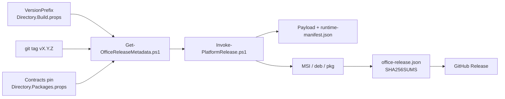

# 60 · Release

**Audience:** release engineers, and contributors preparing a tagged version. Operators who are installing or
upgrading an Office should read `docs/40-operations/` instead.

Office is an independently versioned installable deliverable. A release is a signed, certified,
manifest-verified set of installers published to GitHub Releases. This section documents how a version becomes
a release, and what an administrator is actually holding when one arrives.

> **Never publish or sign from an ordinary development runner.** Release signing and certification require the
> hardened platform workflows (`.github/workflows/release.yml` and the self-hosted runner images behind it).
> A development machine may build a payload and run the development certification path; it must not produce a
> signed, published asset.

| Page | Covers |
|---|---|
| [01-versioning-and-compatibility.md](01-versioning-and-compatibility.md) | The three version truths, the script that enforces agreement, and the contracts compatibility rule. |
| [02-payload-and-manifest.md](02-payload-and-manifest.md) | What a payload contains on each platform, and what `runtime-manifest.json` binds. |
| [03-certification.md](03-certification.md) | What the smoke paths verify, the evidence file shape, and the development signers. |
| [04-release-pipeline.md](04-release-pipeline.md) | `ci.yml` and `release.yml`: triggers, runners, environments, secrets, and stages. |
| [05-signing-and-provenance.md](05-signing-and-provenance.md) | Per-platform signing, the SBOM, provenance attestation, and the release manifest. |
| [06-release-notes-process.md](06-release-notes-process.md) | The `releases/*.md` convention, with 0.4.0 through 0.5.3 as a worked example. |

## How the pieces relate

Certification happens before `Invoke-PlatformRelease.ps1` on the hardened runner. The script consumes the
certified guest image, its signature, the signing certificate, and the certification evidence as protected
environment variables and fails immediately when any of them is absent. See [03-certification.md](03-certification.md).

## The two rules that shape everything here

- **The tag must equal the source.** `Get-OfficeReleaseMetadata.ps1` refuses a tag that does not name the
  `VersionPrefix` in `Directory.Build.props`. There is no override. See
  [01-versioning-and-compatibility.md](01-versioning-and-compatibility.md).
- **Assets are immutable and canonical on GitHub Releases.** `c-sweet.com` links to those assets; Office never
  self-updates. See [05-signing-and-provenance.md](05-signing-and-provenance.md).

## Sources

`AGENTS.md`, `README.md`, `.github/workflows/{ci.yml,release.yml}`, `scripts/release/*`, `release/office-release.schema.json`.

Verified: 2026-09-15.
