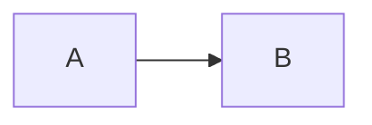

# Documentation style

**Audience:** anyone writing or reviewing a page under `docs/`. **This page is normative.**

The `docs/` directory has no separate specification behind it; the pages are the specification's reference
surface, and the code wins when the two disagree. These rules keep the surface verifiable.

## The rules

### 1. Every behavioral claim cites a source file

If a sentence says the system does something, name the file that does it — in the prose, in a table cell, or in
the page's `## Sources` list. `docs/10-system/04-solution-map.md` names `Directory.Build.targets`,
`Directory.Build.props`, and the solution files for its claims; `docs/30-workloads/06-guest-images.md` names
`build/linux-firecracker/provision-guest.sh` for the guest hardening list. Do the same.

Do not write a claim you have not read. Do not generalize from a name: "the manifest is validated" is not a
claim, "`PlatformRuntimePayloadManifest` rejects a file whose digest no longer matches" is.

### 2. Every page ends with `## Sources` and a `Verified:` line

```
## Sources

`src/CSweet.Office.Runtime.Core/PlatformRuntimePayloadManifest.cs`, `scripts/linux/new-runtime-payload.sh`.

Verified: 2026-09-15.
```

List repo-relative paths. Use a brace expansion or directory form when the list would be unwieldy
(`scripts/windows/{A.ps1,B.ps1}`). The date is the day the page was last checked against those sources, not the
day it was written.

### 3. Security invariants are defined once and cited by identifier

`SEC-INV-nn` identifiers are defined only in
[../20-security/11-security-invariants.md](../20-security/11-security-invariants.md). Everywhere else — in
`docs/`, in `AGENTS.md`, in review comments — cite the identifier and never restate the rule. Never renumber:
new invariants are appended. When a page needs to explain the mechanism behind an invariant, link the
mechanism page and cite the identifier, as `docs/30-workloads/06-guest-images.md` does.

### 4. Out-of-repo behavior is marked, never inferred

Headquarters (C-Sweet), the `CSweet.Office.Contracts` package, `CSweet.Isolation`, and the hardened release
runners all live elsewhere. State the boundary with a callout and cite the in-repo evidence:

```
> **Out of repo:** `CSweet.LinuxImage` lives in the sibling `CSweet.Isolation` repository. The script imports
> it as its first statement after the parameter block, so a missing sibling checkout fails immediately.
```

If this repository only consumes a value (an environment variable, a certificate, an evidence file), say so
and stop. Never describe the producer's internals, and never describe behavior you cannot point at.

### 5. Mermaid for diagrams

Use a fenced `mermaid` block. Do not hand-draw ASCII art. Keep a diagram small enough to read without zooming;
the `graph TD` in `docs/10-system/04-solution-map.md` and the sequence diagrams in
`docs/10-system/05-request-and-data-flow.md` are the size to aim for. ASCII is acceptable only where Mermaid
cannot express the structure — for example a fixed column of file content quoted from a script.

### 6. Declarative voice, no emoji, no marketing

Short sentences. Present tense. Describe the system; do not sell it. No emoji anywhere, including tables and
headings. No "simply", "just", "seamless", "powerful", "robust", "best-in-class". Do not address the reader as
"you" in mechanism pages; the audience line, checklists, and instructions are the exceptions.

### 7. `MUST` and `MUST NOT` are reserved for invariants

In `docs/`, those two words appear in
[../20-security/11-security-invariants.md](../20-security/11-security-invariants.md) and in
`docs/70-contributing/` where a rule is being stated. Everywhere else, describe what the code does. If you find
yourself reaching for `MUST` to emphasize an ordinary requirement, the requirement probably belongs in an
invariant or in the contributor rules — and if it is already there, cite it.

### 8. Escape `|` inside table cells

Write `ReadWrite \| Synchronize \| CreateNewInstance`, not a bare pipe. A bare pipe ends the cell and silently
destroys the table.

### 9. Sentence-case headings

`## The two solutions`, `## What the smoke path actually runs`. Capitalize the first word and proper nouns.
Do not use Title Case, and do not put trailing punctuation in a heading.

### 10. State the audience at the top of every page

The first line after the H1 is an audience line, optionally followed by a "read this before" pointer:

```
**Audience:** release engineers, and contributors changing the payload generators.
```

Section indexes (`docs/60-release/README.md`) and this page are the only pages allowed to skip it, and even
there an audience line is preferred.

### 11. Add a page or extend one

| Add a page when | Extend an existing page when |
|---|---|
| The topic has its own source surface — its own scripts, types, or workflow file — and a reader would look for it by that name. | The new material is another table row, another field, or another step in a mechanism already described. |
| The page would exceed roughly 200 lines with the addition. | The addition keeps the page readable in one sitting. |
| The topic has a different audience than the host page (a release engineer's checklist inside a contributor's mechanism page). | The audiences match and the flow is already continuous. |

Numbering within a section is fixed: append the next number, and do not renumber existing pages. Every new page
must be added to its section index and, when appropriate, to the reading paths in `docs/README.md`.

### 12. When you find drift

If a page disagrees with the code:

1. Fix the page, then update its `Verified:` date.
2. If you cannot fix it, record the discrepancy explicitly in the page — what the page claims, what the code
   does, and where. [../60-release/02-payload-and-manifest.md](../60-release/02-payload-and-manifest.md)
   records a guard whose comparison threshold and message disagree in exactly this way.
3. Never leave a claim that is quietly wrong, and never delete a claim merely because you could not verify it;
   say which part is unverified.

### 13. Links must resolve

A relative link must point at a file that exists. Do not link a page you have not created, and do not link a
planned page from a published one — name the intended path in `code` style instead. When a page is created,
update the links that describe it.

## Page skeleton

````markdown
# Title in sentence case

**Audience:** who should read this, and what they are about to change.

One paragraph stating what this page covers and what it does not.

## First section

Content, with sources named in the prose or in tables.



> **Out of repo:** what belongs elsewhere, and the in-repo evidence for the boundary.

## Sources

`path/one`, `path/two`.

Verified: YYYY-MM-DD.
````

## Sources

`docs/README.md`, `docs/10-system/04-solution-map.md`, `docs/30-workloads/06-guest-images.md`,
`docs/20-security/11-security-invariants.md`, `docs/60-release/02-payload-and-manifest.md`, `AGENTS.md`.

Verified: 2026-09-15.
