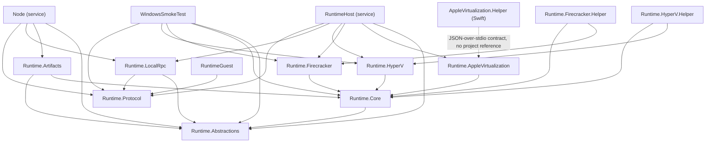

# Project reference

**Audience:** contributors and reviewers who need the type-level facts about one project rather than the
system-level view in [10-system/04-solution-map.md](../../10-system/04-solution-map.md).

Every folder under `src/` has exactly one page in this directory. Each page states the project facts taken
from the `.csproj`, the load-bearing types with their real names, the composition of any executable entry
point, the non-obvious behaviour, the test coverage in `tests/CSweet.Office.Tests`, and the relevant
documentation pages.

The pages are written against the code, not against a specification. Where a page and the code disagree, the
code and the tests win.

## All 19 projects

Every .NET project targets `net10.0`, set once in `Directory.Build.props`; only `BuilderGuest` and
`ToolchainGuest` restate it in their own `.csproj`. The Swift helper is not a .NET project.

| Project | Output kind | Target framework | Project references | Purpose |
|---|---|---|---|---|
| [`Runtime.Abstractions`](runtime-abstractions.md) | library | `net10.0` (inherited) | — | Provider-neutral contracts, models, and the provider catalog. |
| [`Runtime.Core`](runtime-core.md) | library | `net10.0` (inherited) | `Runtime.Abstractions` | Shared backend plumbing: helper protocol, payload manifest, guest image registry, ISO writer, fail-closed selector, in-memory test doubles. |
| [`Runtime.Protocol`](runtime-protocol.md) | library | `net10.0` (inherited) | — | Private local-RPC wire contracts (`GrpcServices="None"`) and the HMAC request authenticator. |
| [`Runtime.LocalRpc`](runtime-localrpc.md) | library | `net10.0` (inherited) | `Runtime.Abstractions`, `Runtime.Protocol` | Node↔RuntimeHost transport, RPC server, dispatcher, provider client, and the authorization gate. |
| [`Runtime.Artifacts`](runtime-artifacts.md) | library | `net10.0` (inherited) | `Runtime.Abstractions`, `Runtime.Core` | Filesystem artifact store and read-only ISO media store. |
| [`Runtime.HyperV`](runtime-hyperv.md) | library | `net10.0` (inherited) | `Runtime.Core` | Hyper-V backend, `AF_HYPERV` socket transport, host probe, feature provisioner, Windows provisioner, progress store. |
| [`Runtime.HyperV.Helper`](runtime-hyperv-helper.md) | console exe | `net10.0` (inherited) | `Runtime.Core`, `Runtime.HyperV` | Privileged, narrow Hyper-V lifecycle helper driven over stdio JSON. |
| [`Runtime.Firecracker`](runtime-firecracker.md) | library | `net10.0` (inherited) | `Runtime.Core` | Firecracker/KVM backend and stdio guest-channel connector. |
| [`Runtime.Firecracker.Helper`](runtime-firecracker-helper.md) | console exe | `net10.0` (inherited) | `Runtime.Core`, `Runtime.Firecracker` | Firecracker/jailer lifecycle helper and Firecracker API client. |
| [`Runtime.AppleVirtualization`](runtime-apple-virtualization.md) | library | `net10.0` (inherited) | `Runtime.Core` | Apple Virtualization.framework backend and stdio guest-channel connector. |
| [`Runtime.AppleVirtualization.Helper`](runtime-apple-virtualization-helper.md) | Swift package executable | n/a (SwiftPM, macOS 14) | — | macOS helper: workload host process plus the helper CLI. |
| [`Node`](node.md) | worker service exe | `net10.0` (inherited) | `Runtime.Abstractions`, `Runtime.Artifacts`, `Runtime.LocalRpc`, `Runtime.Protocol` | Unprivileged control client: enrollment, certificates, heartbeat, assignments, artifact cache, guest relay. |
| [`RuntimeHost`](runtime-host.md) | worker service exe | `net10.0` (inherited) | `Runtime.Abstractions`, `Runtime.AppleVirtualization`, `Runtime.Firecracker`, `Runtime.HyperV`, `Runtime.LocalRpc`, `Runtime.Protocol` | Privileged virtualization service: RPC server, authorization gate, provider backends, workload reaper. |
| [`Configurator`](configurator.md) | console exe | `net10.0` (inherited) | — | Windows enrollment handoff and the maintenance service host. |
| [`RuntimeGuest`](runtime-guest.md) | console exe | `net10.0` (inherited) | `Runtime.Protocol` | In-guest broker: materializes artifacts, performs the handshake, proxies agent requests, supervises the workload. |
| [`BuilderGuest`](builder-guest.md) | console exe | `net10.0` (explicit) | — | In-guest plugin build runner. |
| [`ToolchainGuest`](toolchain-guest.md) | console exe | `net10.0` (explicit) | — | In-guest toolchain adapter runner and deterministic output bundler. |
| [`GuestProbe`](guest-probe.md) | console exe | `net10.0` (inherited) | — | In-guest probe used only by the isolation certification smoke test. |
| [`WindowsSmokeTest`](windows-smoke-test.md) | console exe | `net10.0` (inherited) | `Runtime.Abstractions`, `Runtime.Core`, `Runtime.Firecracker`, `Runtime.HyperV`, `Runtime.Protocol` | Runs a real guest and emits certification evidence only after isolation checks pass. |

The four guest executables — `RuntimeGuest`, `BuilderGuest`, `ToolchainGuest`, `GuestProbe` — deliberately
have no project references to the runtime libraries. They compile against the `CSweet.Office.Contracts`
package and the shared global usings, so a guest image never drags the runtime or provider libraries into the
image. `RuntimeGuest` is the sole exception: it references `Runtime.Protocol` because it needs the generated
guest envelope types. `Configurator` has no project references either.

## Dependency graph

`Runtime.AppleVirtualization.Helper`, `Configurator`, `BuilderGuest`, `ToolchainGuest`, and `GuestProbe`
appear with no incoming project reference: they are invoked as processes, not linked as libraries.

## Solution membership

| Solution | Members |
|---|---|
| `CSweet.Office.slnx` | All 18 .NET projects plus `tests/CSweet.Office.Tests` and the sibling `CSweet.Office.Contracts` project. |
| `CSweet.Office.Independent.slnx` | The same set minus `CSweet.Office.ToolchainGuest` and minus the contracts project, which resolves as the pinned NuGet package. |
| Neither | `src/CSweet.Office.Runtime.AppleVirtualization.Helper` — a Swift package built with SwiftPM. |

See [10-system/04-solution-map.md](../../10-system/04-solution-map.md) for the contracts switch and the
toolchain-guest asymmetry.

## Sources

`CSweet.Office.slnx`, `CSweet.Office.Independent.slnx`, `Directory.Build.props`, `src/**/*.csproj`,
`src/CSweet.Office.Runtime.AppleVirtualization.Helper/Package.swift`.

Verified: 2026-09-15.
